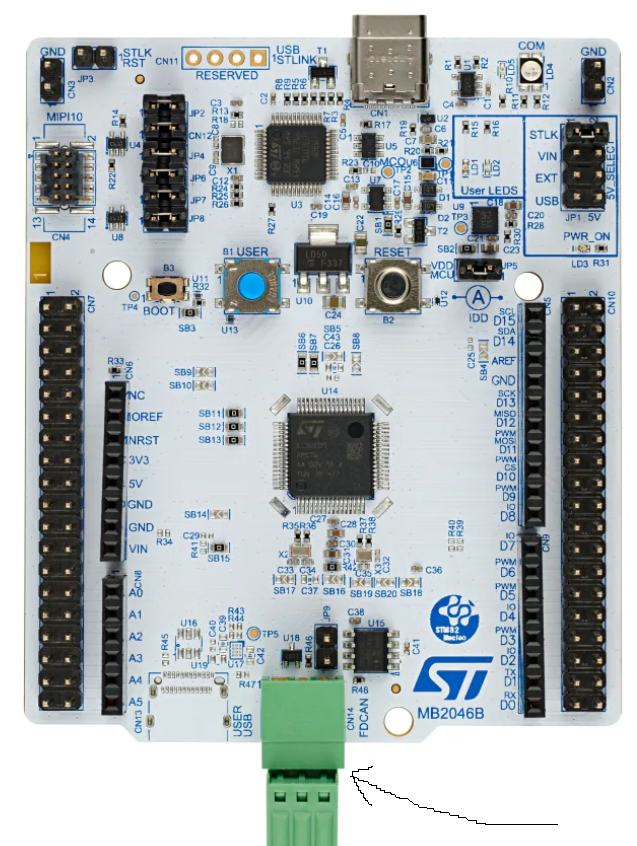

# UDS Server on STM32 Nucleo C092RC

This project implements a Unified Diagnostic Services (UDS) server based on the ISO 14229-1 standard.
It based on [UDS Library](https://github.com/LionEmbed/uds_lib).

Demos include below UDS services:  
* Tester Present

  
**CAN connector is shown with an arrow**